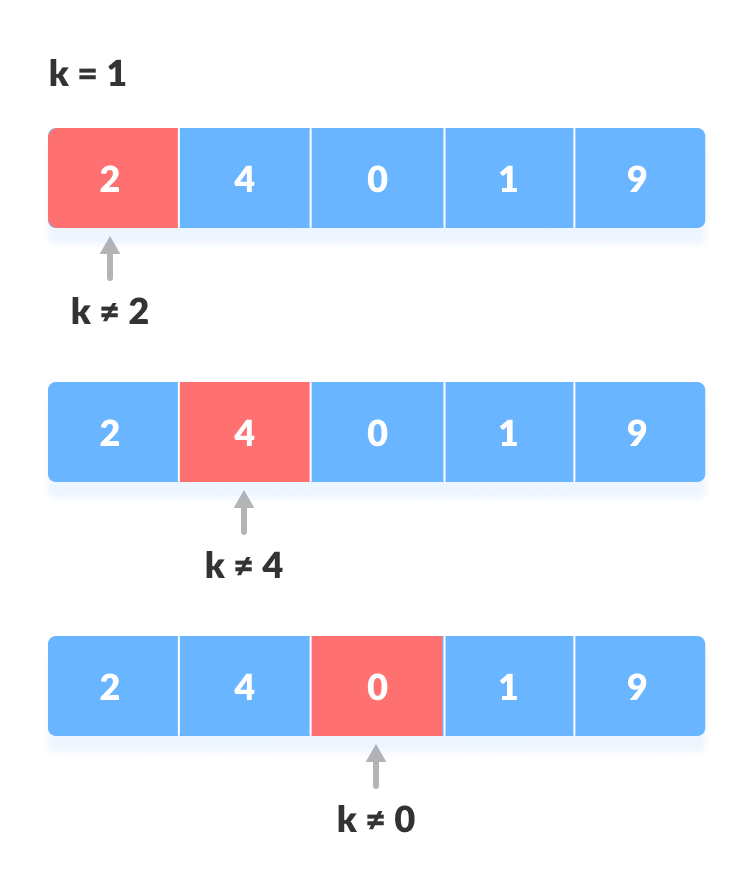
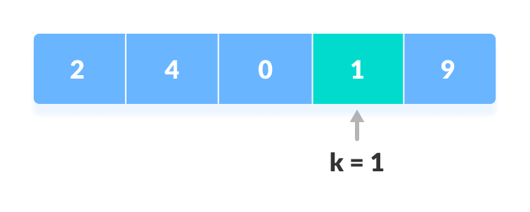
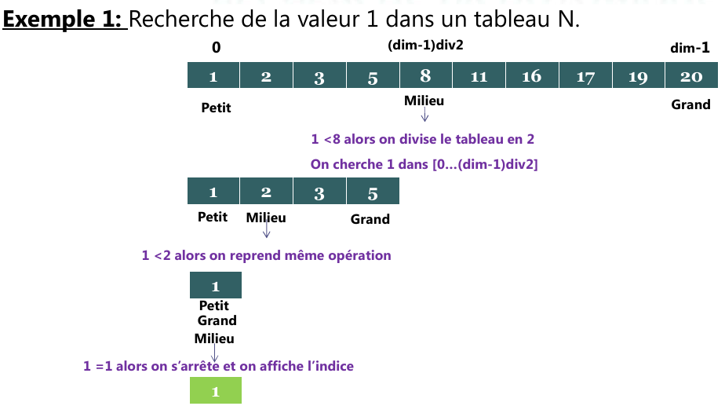

les algorithmes de recherche

# les algorithmes de recherche
28/10/2020 20:16
## Recherche séquentielle / linéaire


* on parcours les élement d'un tableau **non trié** à partir du début



### Recherche séquentielle en C
```c
// Linear Search in C

#include <stdio.h>

int search(int array[], int n, int x) {
  
  // Going through array sequencially
  for (int i = 0; i < n; i++)
    if (array[i] == x)
      return i;
  return -1;
}

int main() {
  int array[] = {2, 4, 0, 1, 9};
  int x = 1;
  int n = sizeof(array) / sizeof(array[0]);

  int result = search(array, n, x);

  (result == -1) ? printf("Element not found") : printf("Element found at index: %d", result);
}
```
## Recherche dichotomique

*  on commence par décoper le tableau en deux tablea.
*  on compare la valeur recherchée avec la valeur du milieu du tableau.
*  * si la valeur est rechercher est inférieur a la valeur du millieu, alors on cherche dans la 1ére moitié du tableau.
*  * si la valeur rechercher est supérieure à la valeur du milieu, Alors on cherche dans la 2éme moitié du tableau.
*  * on continue le découpage jusqu'à un sous tableau de dimention 1



### Recherche dichotomique en C

```C
// Binary Search in C

#include <stdio.h>

int binarySearch(int array[], int x, int low, int high) {
  // Repeat until the pointers low and high meet each other
  while (low <= high) {
    int mid = low + (high - low) / 2;

    if (array[mid] == x)
      return mid;

    if (array[mid] < x)
      low = mid + 1;

    else
      high = mid - 1;
  }

  return -1;
}

int main(void) {
  int array[] = {3, 4, 5, 6, 7, 8, 9};
  int n = sizeof(array) / sizeof(array[0]);
  int x = 4;
  int result = binarySearch(array, x, 0, n - 1);
  if (result == -1)
    printf("Not found");
  else
    printf("Element is found at index %d", result);
  return 0;
}
```
