les algorithmes de tri

# les algorithmes de tri
28/10/2020 19:44

## Tri par sélection

Complexité = $O(n^2)$

- on cherche le plus petit élément de tableau
- on place cette element au debut
- on recherche d'un nouveau minimum
- on place en second position
- ...  
    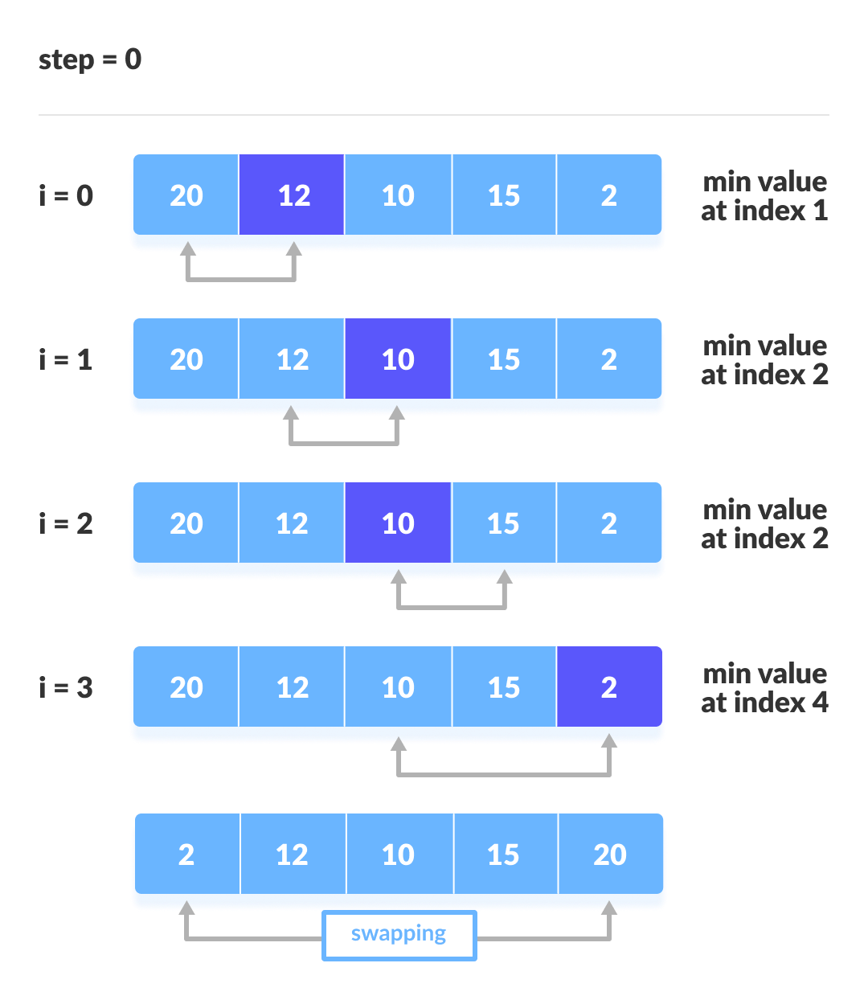  
    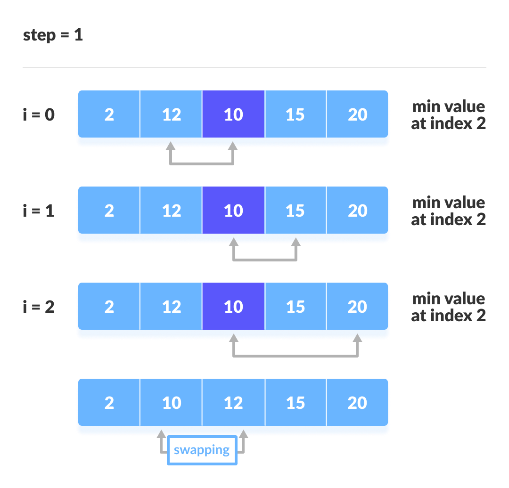  
    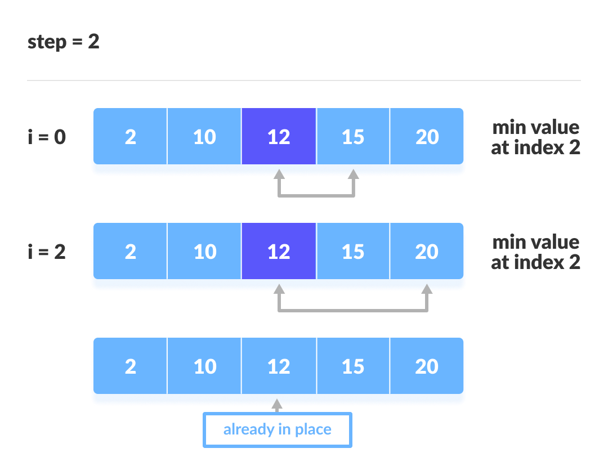  
    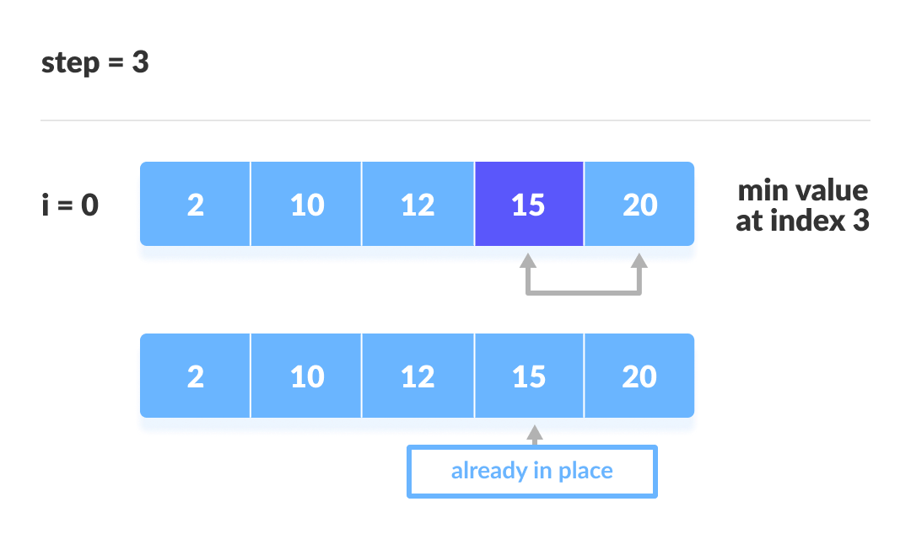

### Tri par sélection en C

```c
// Selection sort in C

#include <stdio.h>

// function to swap the the position of two elements
void swap(int *a, int *b) {
  int temp = *a;
  *a = *b;
  *b = temp;
}

void selectionSort(int array[], int size) {
  for (int step = 0; step < size - 1; step++) {
    int min_idx = step;
    for (int i = step + 1; i < size; i++) {

      // To sort in descending order, change > to < in this line.
      // Select the minimum element in each loop.
      if (array[i] < array[min_idx])
        min_idx = i;
    }

    // put min at the correct position
    swap(&array[min_idx], &array[step]);
  }
}

// function to print an array
void printArray(int array[], int size) {
  for (int i = 0; i < size; ++i) {
    printf("%d  ", array[i]);
  }
  printf("\n");
}

// driver code
int main() {
  int data[] = {20, 12, 10, 15, 2};
  int size = sizeof(data) / sizeof(data[0]);
  selectionSort(data, size);
  printf("Sorted array in Acsending Order:\n");
  printArray(data, size);
}
```

## Tri à bulles

complexité = $O(n^2)$

- on parcours le tableau
- on compare les éléments de tableau deux a deux
- si le premier élement est plus grand de deuxiéme,ils sont echangées
- aprés chaque parcours on recommence l'opération avec les élements restants

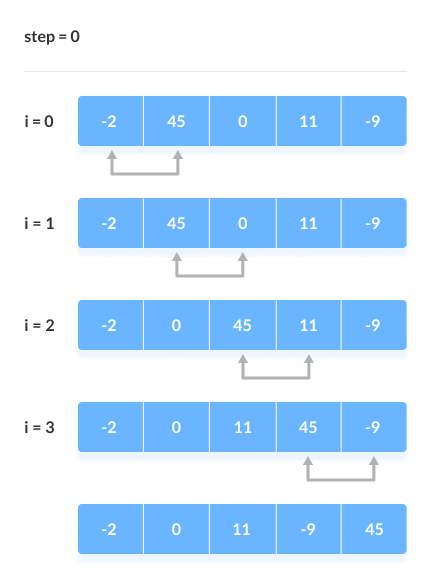  
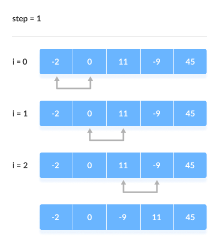  
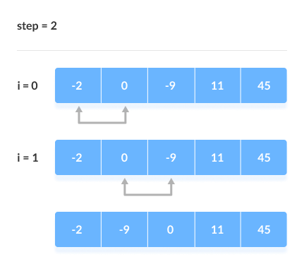  
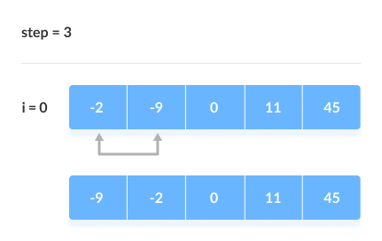

### Tri a bulles en C
```C
// Bubble sort in C

#include <stdio.h>

void bubbleSort(int array[], int size) {

  // run loops two times: one for walking throught the array
  // and the other for comparison
  for (int step = 0; step < size - 1; ++step) {
    for (int i = 0; i < size - step - 1; ++i) {
      
      // To sort in descending order, change">" to "<".
      if (array[i] > array[i + 1]) {
        
        // swap if greater is at the rear position
        int temp = array[i];
        array[i] = array[i + 1];
        array[i + 1] = temp;
      }
    }
  }
}

// function to print the array
void printArray(int array[], int size) {
  for (int i = 0; i < size; ++i) {
    printf("%d  ", array[i]);
  }
  printf("\n");
}

// driver code
int main() {
  int data[] = {-2, 45, 0, 11, -9};
  int size = sizeof(data) / sizeof(data[0]);
  bubbleSort(data, size);
  printf("Sorted Array in Ascending Order:\n");
  printArray(data, size);
}
```

## Tri par insertion
$Complexité = O(n^2)$
* on prend le premier élement
* on prend le deuxième élément et on le trie par rapport au premier
* on trie les éléments suivants par rapport aux éléments déjà triés
* ...
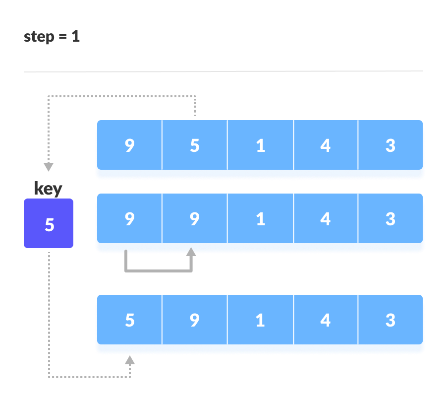

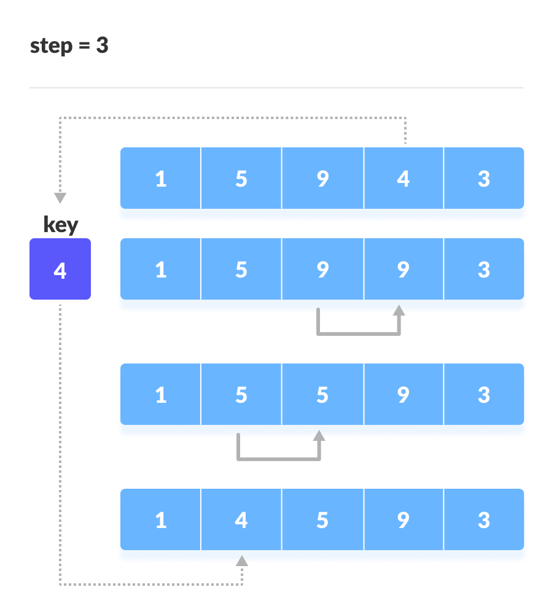
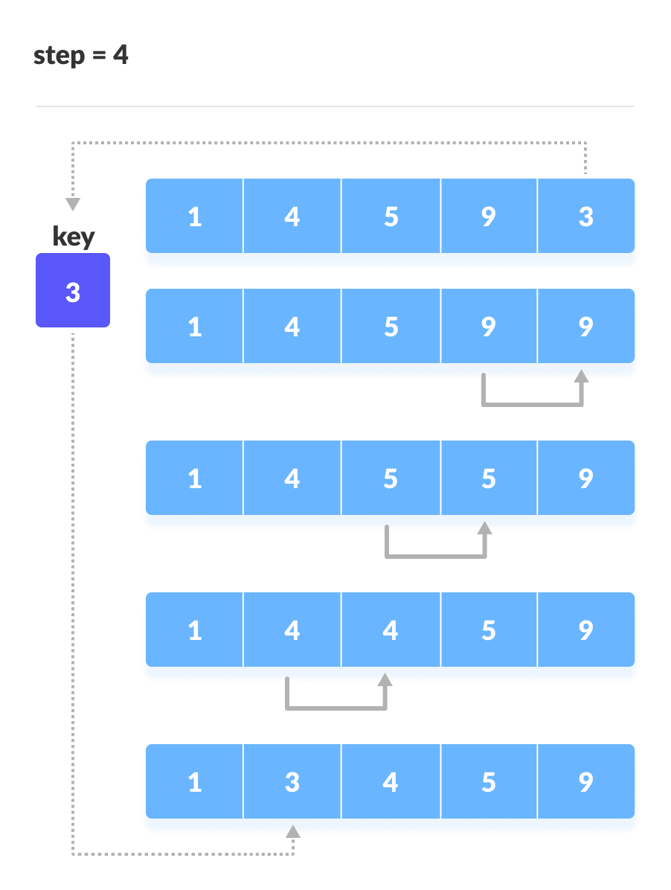
### Tri par insertion en C
```C
// Insertion sort in C

#include <stdio.h>

// Function to print an array
void printArray(int array[], int size) {
  for (int i = 0; i < size; i++) {
    printf("%d ", array[i]);
  }
  printf("\n");
}

void insertionSort(int array[], int size) {
  for (int step = 1; step < size; step++) {
    int key = array[step];
    int j = step - 1;

    // Compare key with each element on the left of it until an element smaller than
    // it is found.
    // For descending order, change key<array[j] to key>array[j].
    while (key < array[j] && j >= 0) {
      array[j + 1] = array[j];
      --j;
    }
    array[j + 1] = key;
  }
}

// Driver code
int main() {
  int data[] = {9, 5, 1, 4, 3};
  int size = sizeof(data) / sizeof(data[0]);
  insertionSort(data, size);
  printf("Sorted array in ascending order:\n");
  printArray(data, size);
}
```
