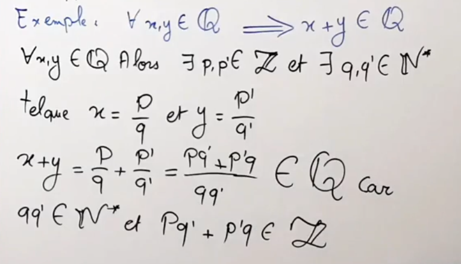
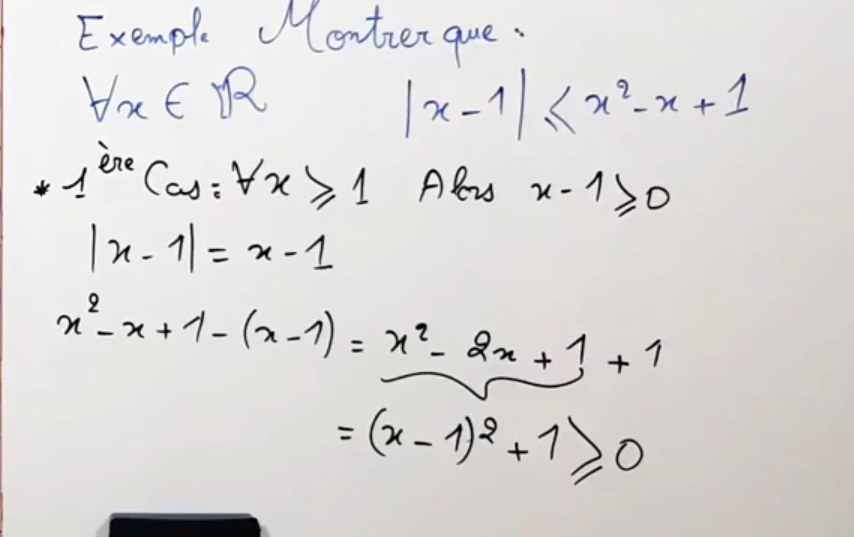
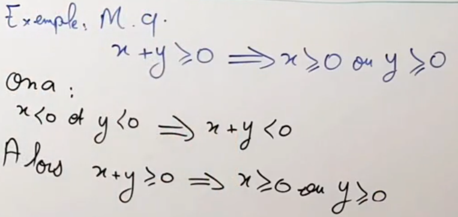
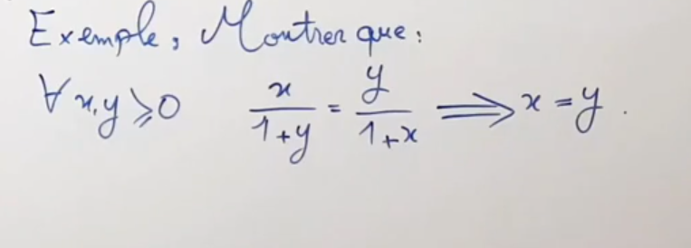
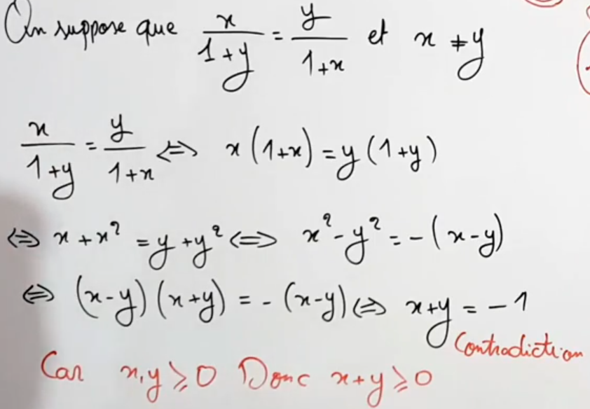
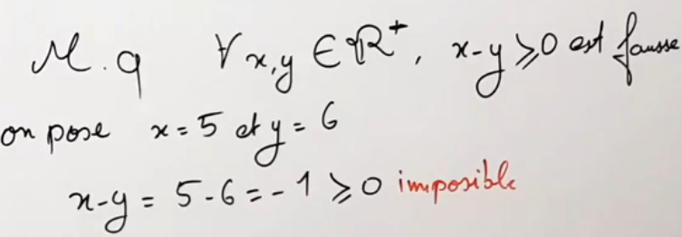
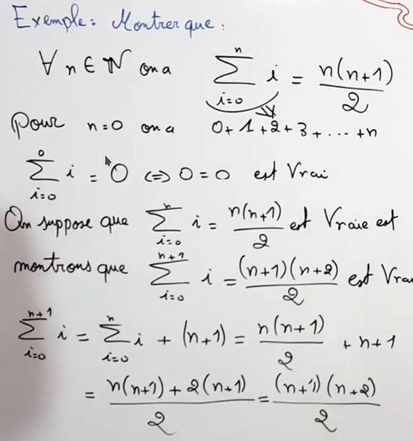

Logique: 2- Raisonnements

# logique
# Raisonnements

## raisonnement direct:
* On veut montrer que l'assertion «$P$ $=>$ $Q$» et Vrais
* * On suppose que $P$ est vrais et on montre alors $Q$ est vrai.

## Cas par cas:

## Contraposée:

($P$ $<=>$ $Q$) $->$ (non $Q$ $<=>$ non $P$)

## Absurde
"$P => Q$" est Vrai:
On supose a la fois que $P$ est vrais et que $Q$ et fausse et on cherche une contradiction.

## Contre-exemple
  
  
  
## Récurrance:
Soit $P(n)$ une Propriété qui dépend de $n$ ($n$ $\in$ $IN$)
Pour montrer que $P(n)$ est vrais $\forall n \in IN$
On peut raisonner par récurrence sur n de la façon suivante:
* On vérifie que $P(0)$ est vrai.
* On pose $P(n)$ est vrai et montrer que $P(n+1)$ est vrai.
