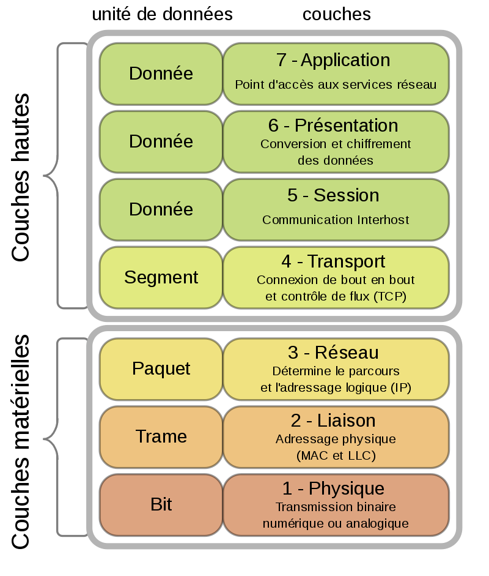

1- Modéle osi

# Modéle Osi
Osi $=$ Open Systems Interconnection
* Couche 1 : **P**hysique (Physical)
* Couche 2 : **L**iaison de données(Data Link)
* Couche 3 : **R**éseau (Network)
* Couche 4 : **T**ransport
* Couche 5 : **S**ession
* Couche 6 : **P**résentation
* Couche 7 : **A**pplication

**P**our **l**e **r**éseau **t**out **s**e **p**asse **a**utomatiquement

#
## Couche Physique
* la premiére couche du modéle OSI
* Chargée de la transmission effective des signeaux(optique,electrique...)au niveau matériel
* Chargée de la conversion entre bits et signaux électriques ou optiques
## Couche Liaison de données
* Fournit les moyens fonctionnels et procéduraux pour le transfert de données entre des entités d'un réseau.
* Transfére des données entre les noeuds adjacent d'un réseau étandu (WAN).
* transfére des donnée entre ldes noeuds sure le meme segment d'un réseau local (LAN).
* Contient (dans certain cas) les moyens de détection des erreurs qui peuvent survenir au niveau de la couche physique.
## Couche Réseau
* s'occupe de toute qui a trait à internet
* Prend en charge la connectivité et le routage (la selection du chemin)
* contient les protocoles **[ipv4](https://fr.wikipedia.org/wiki/IPv4)** et **ipv6**
## Couche Transport
* gére la communications de bout en bout entre processus
* contient les protocoles **[TCP](https://fr.wikipedia.org/wiki/Transmission_Control_Protocol)** (transport fiable des données) et **[UDP](https://fr.wikipedia.org/wiki/User_Datagram_Protocol)** (transport non fiable)
* multiplexage et démultiplexage ??

Pour plus d'informations, [cliquez ici](https://www.youtube.com/watch?v=o6xGf7uJ-j4)
## Couche Session

* Prend en charge l'établissement, la gestion et la terminaison de session entre deux hôtes
* Contient le protocole **[SOCKS](https://fr.wikipedia.org/wiki/SOCKS)**

## Couche Présentation
* Responsable du formatage et de la structuration des données pour la couche Aplication par:
	* Compression
	* Conversion de code caractére
	* Chifrfrement et déchiffrement