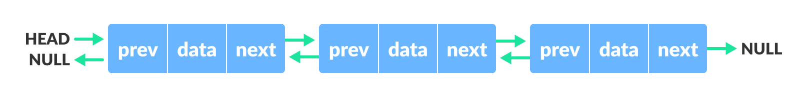

les listes chainées

# Définition


* Semblables aux tableau sauf que l'accés à un élement se fait par un pointeur au lieu d'indice.
* Chaque élément étant repéré par ses voisins auxquels il est relié.
* l'allocation de mémoire se fait dynamiquement

# liste simplement chainée 
Définie par:
* **Tete**: Pointeur vers le premier élement.
* **Suivant**: chaque élément a un pointeur vers l'élément suivant.
* **Valeur**: valeur de la donnée d'un noeud.
* **Fin**: le pointeur suivant du dernier élément doit pointer ver NULL.

### Représentation des listes simplement chainées en C

```C

//Déclaration
	typedef struct noeud{
		int num;
		struct noeud *suivant;
		}Noeud;
	
	//ou	
	struct noeud{
		int num;
		struct noeud *suivant;
		};
	typedef struct noeud Noeud;

//Initialisation:
	Noeud *tete;
	tete = NULL;

//Insertion au début de la liste:
	Noeud * Nouveau;
	Nouveau =(Noued*)malloc(sizeof(Noeud));
	Nouveau->num=122;
	Nouveau->suivant=Tete;
	Tete=Nouveau
	//dans une fonction
		//la fonction
		Noeud* ajoutDebut(Noeud *teteL, Noeud * n){
			n->s = teteL;
			teteL=n;
		return teteL;
		//main
		main(){
			Noeud *L,*nv;
			L=ajoutDebut(L,nv)
		}
}
		
//Insertion à la fin de la liste:
	Noeud *courant = Tete;
	Noeud *Nouveau;
	if (Tete != NULL) {
		while (courant->suivant != NULL)
			courant = courant->suivant;
	}
	Nouveau = (Noeud *)malloc(sizeof(Noeud));
	Nouveau->num= 127 ;
	courant->suivant = Nouveau;
	Nouveau->suivant = NULL;
//Suppression du premier Noeud de la liste
	Noeud *p;
	p=tete;
	tete=tete->suivant;
	free(p);
//Suppression du dernier Noeud de la liste
	Nœud *courant,*p ;
	if(tete->suivant!=NULL) {
		courant=tete ;
		while(courant->suivant->suivant !=NULL)
			courant=courant->suivant;

		p=courant->suivant ;
		courant->suivant=NULL ;
		free(p);
	}

```

# liste doublement chainée


Définie par:
* **Tete**: Pointeur vers le premier élement.
* **Suivant**: chaque élément a un pointeur vers l'élément suivant.
* **Precedent**: chaque élément a un pointeur vers l'élément précèdent.
* **Valeur**: valeur de la donnée d'un noeud.
* **Fin**: le pointeur suivant du dernier élément doit pointer ver NULL.

### Représentation des listes doublement chainées en C

```C

//Déclaration
	typedef struct noeud{

	char nom[20];
	int num ;
	struct noeud * suivant;
	struct noeud * precedent;

	}Noeud;
```
